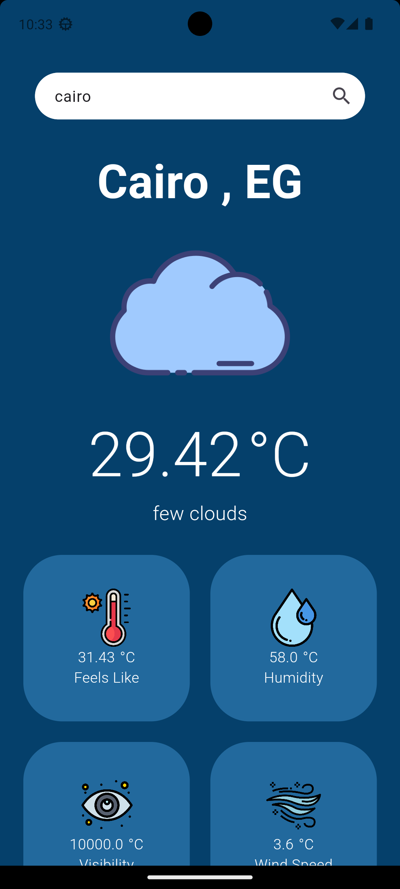
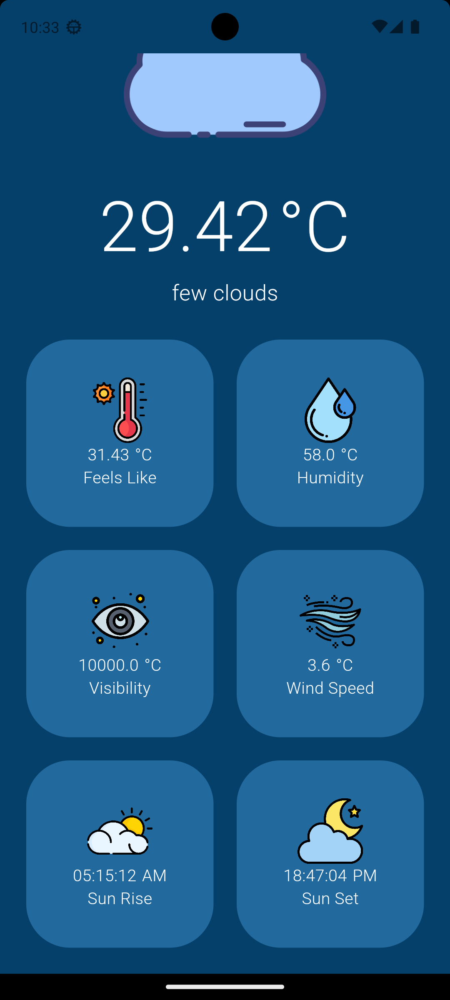

# weather_app

Weather App
A Flutter application to display weather information using the OpenWeatherMap API and GetX for state management.

Features
Fetch and display current weather data for a specified city.
Show weather details such as temperature, humidity, visibility, wind speed, sunrise, and sunset times.
Handle errors and provide user feedback if the city is not found or if there are network issues.

## Screen Shots

- Search

- Not Found City

- Loading

- Find City

